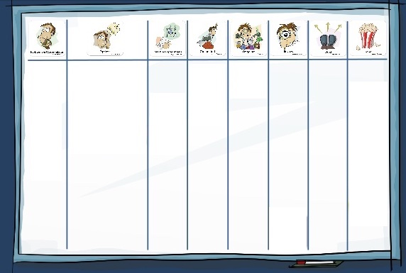

theme: Fira, 0

# PopcornFlow

---

### "Oh, hai!" :wave:
## 1. Your favourite Game of Thrones character :heart:
## 2. Who will die next :skull:

^ 5m
introduction activity

---

# To The Wall!

^ 5m
PopcornFlow posters go up
1. All about the power of **Options.**
- Options come from **Problems.**
- Which lead to **Possible Experiments**
- Change is hard, so make it continuous: the rest.

---

# Make a PopcornFlow board

---

### Your facilitators

## Steve @maxbarners
## Austin @austin_fagan

^ 1m
- where you work, what you do
- fave character, who dies next

---

^ TV show, not the books

---

# Season 6

^ 5m for whole thing
Set the scene

---

## :rotating_light: #SPOILERS :rotating_light:

---

### **Dead :skull:**

## High Sparrow
## Margaery Tyrell
## Tommen Baratheon

---

### **On the warpath ⚔**

## Cersei Lannister
## Tyrells & Martells
## Jon Snow
## Arya Stark

---

### **On the warpath ⚔**

## Daenerys Targaryen
## Tyrion Lannister
## Greyjoys

---

# Acquaint thyself with... thyself

^ >= 6m
give out A4 family printouts

---

### **Problems**

## Generate problems on stickies

^ 5m
Put up ":point_up: you are here"
generate lots, can be a bit silly
your house

---

### **Problems**

## Dot vote to pick one to work on

^ 2m

---

### **Problems**
## Observations?

^ 3m
Chat
Who, what?

---

### **Options**

## Pick 2 resources
## Generate an option

^ 5m
Move ":point_up: you are here"
What can you do with your resources?
What’s the impact?
Repeat until you have 3 options
We’ll measure it later

---

### **Possible Experiments**

## At least 2 per option

^ 5m
Move ":point_up: you are here"
Grab an index card and a pen

---

### **Possible Experiments**

## Pick one to do first

^ 1m

---

^ 1m
four bits

---

^ 10m
"Yes and"
Okay to be vague (?)
More resources means more weighted against success.
Should be rapid and focus on continual change.

---

### **Committed**

## What's the *expected* outcome?

^ 1m
Move ":point_up: you are here"

---

^ 2m

---

### **Ongoing**

## Dot vote
## What's the shortest?
## What will let you learn the most, fastest?

^ 1m
Move ":point_up: you are here"
GoT, so about to go south
Chaos monkey

---

### **Review**

## Move 1 table clockwise

^ 1m
Move ":point_up: you are here"
Handout outcomes sheet

---

### **Review**

## Circle one of the outcomes :grimacing:

^ 3m

---

### **Review**

## Back to your table
## What's the *actual* outcome?

^ It didn't go so well (because GoT)
Write in last spot on index card
Must match your outcome

---

### **Review**

## Consequences of this outcome?
## Changes the Problem or the Options?

^ 3m
Update your stickies

---

### **Next**

### Generate more Options for same problem

^ Move ":point_up: you are here"

---

### **Next**

### Pick an option to work on (can be an old one)

---

### **Next**

### Commit to experiment

---

### **Next**

### Generate the result

^ Do it yourselves this time

---

# Reality!

^ - We develop products. We build features. We follow a process.
- We don't know what the future holds.
- Fearful Fiascos?
- Budget slashed. New competitor in the market. No one likes the product. No one uses the feature. Much more work than we estimated.

---

## It's not fail fast, fail often, it's **learn fast, learn often**.

^ - Glorious success?
- Delivered on time. Great ROI. But was it the best option? How do you know?
- If you are going to follow a plan
- Make sure you understand the problem and it's impact.
- Think of options that address it.
- Conquer complexity by listening to all the opinions.

---

## Everybody has an opinion, but **a shared opinion is a fact**.

^ - Rapid explorations and experiments
- Respond to change

---

## Change is hard, so let's **make it continuous**.

^ Claudio Perrone
Agile Sensei
da boss

---

### **Faciliator feedback**

## What's one thing we could do differently?

