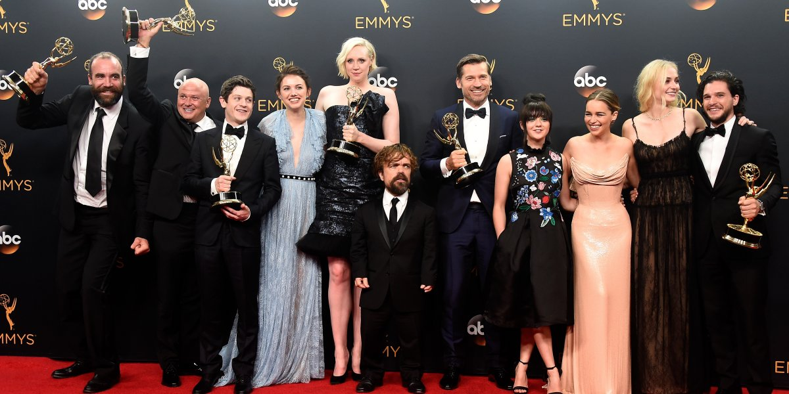

theme: Fira, 0

# PopcornFlow

---

### "Oh, hai!" :wave:
## 1. Your favourite Game of Thrones character :heart:
## 2. Who will die next :skull:

^ 5m
introduction activity

---

# To The Wall!

^ 5m
PopcornFlow posters go up
1. All about the power of **Options.**
- Options come from **Problems.**
- Which lead to **Possible Experiments**
- Change is hard, so make it continuous: the rest.

---

---

### Your facilitators

## Austin @austin_fagan
## Steve @maxbarners

---

---

# Season 6

^ Set the scene

---

## :rotating_light: #SPOILERS :rotating_light:

---

### **Dead :skull:**

## High Sparrow
## Margaery Tyrell
## Tommen Baratheon

---

### **On the warpath ⚔**

## Cersei Lannister
## Tyrells & Martells
## Jon Snow
## Arya Stark

---

### **On the warpath ⚔**

## Daenerys Targaryen
## Tyrion Lannister
## Greyjoys

---

# Families

^ give out A4 family printouts

---

^ House Lannister
- Cersei now Queen
- Jamie witnesses coronation but now what?
- Tyrion serves as Hand of the Queen
- The rest be dead

---

^ House Targaryen
- Daenerys on part of Iron fleet, Dothraki hoard, unsullied, 3 dragons, the Imp to Westeros.
- hitherto unknown nephew on the loose?

---

^ House Greyjoy
- Yara and Theon pledged allegiance to Daenerys
- Euron Greyjoy is King of the Iron Islands, building new Iron fleet.

---

^ House Stark
^ Jon Snow crowned King of The North (yet to be revealed: the son of Ned Stark's sister).
- Littlefinger wants Sansa to rule Westeros by his side.
- Arya has learned some killing skills, dispatching Walder Frey with a knife to the throat.
- Bran is the three-eyed raven, starting to learn extent of his powers.

---

^ House Martell
- Ellaria Sand and the Sandsnakes (Obara, Tyene and Nymeria) assassinated Doran Martell and his son Trystane.
- Ellaria now rules Dorne and looks to ally with Houses Tyrell and Targaryen.

---

## What are this family's resources?   
## Write 1 resource on your poster

^ Wall walk
Have prompts ready

---

## Move 1 poster clockwise   
## Write 1 resource on the poster

^ And again
Repeat until you've written on every poster

---

## Circle the best 4 on your family's poster

^ You'll use these in a minute
2m

---

### **Problems**

## Generate problems on stickies

^ Put up ":point_up: you are here"
5m

---

### **Problems**

## Dot vote to pick one to work on

^ 2m

---

## Observations

^ 5m

---

### **Options**

## Generate 3 options
### What can you do with your resources?
### What’s the impact?

^ Move ":point_up: you are here"
We’ll measure it later

---

### **Options**

## Pick one to do first

---

### **Possible Experiments**

## At least 2 per option

^ Move ":point_up: you are here"
Grab an index card and a pen

---

^ four bits

---

^ "Yes and"
Okay to be vague (?)
More resources means more weighted against success.
Should be rapid and focus on continual change.

---

## More resources means more weighted against success.
## Should be rapid and focus on continual change.

---

### **Committed**

## What's the *expected* outcome?

^ Move ":point_up: you are here"

---

---

### **Ongoing**

## What's the shortest?
## What will let you learn the most, fastest?

^ Move ":point_up: you are here"
Another table chooses it for you? GoT style: little agency and bad things happen! Possibly not very Popcorn-y, but does have options as the focus.

---

### **Review**

## Move 1 table clockwise
## Circle one of the outcomes :grimacing:

^ Move ":point_up: you are here"
Handout outcomes sheet
Back to your table

---

### **Review**

## Back to your table
## What's the *actual* outcome?

^ Write in last spot on index card

---

### **Review**

## What are the consequences of this outcome?
## Does it change Problems or Options?

---

### **Next**

### Generate more Options for same problem

^ Move ":point_up: you are here"

---

### **Next**

### Pick an option to work on (can be an old one)

---

### **Next**

### Commit to experiment

---

### **Next**

### Generate the result

^ Do it yourselves this time

---

# Reality!

^ - We develop products. We build features. We follow a process.
- We don't know what the future holds.
- Fearful Fiascos?
- Budget slashed. New competitor in the market. No one likes the product. No one uses the feature. Much more work than we estimated.

---

## It's not fail fast, fail often, it's **learn fast, learn often**.

^ - Glorious success?
- Delivered on time. Great ROI. But was it the best option? How do you know?
- If you are going to follow a plan
- Make sure you understand the problem and it's impact.
- Think of options that address it.
- Conquer complexity by listening to all the opinions.

---

## Everybody has an opinion, but **a shared opinion is a fact**.

^ - Rapid explorations and experiments
- Respond to change

---

## Change is hard, so let's **make it continuous**.

^ Claudio Perrone
Agile Sensei
da boss

---

### **Faciliator feedback**

## What's one thing we could do differently?

